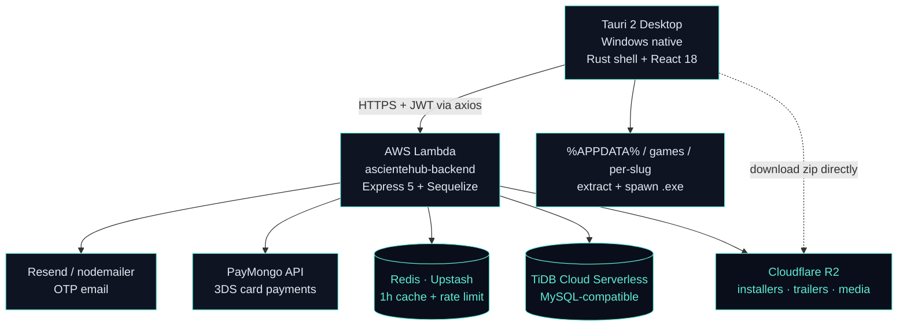
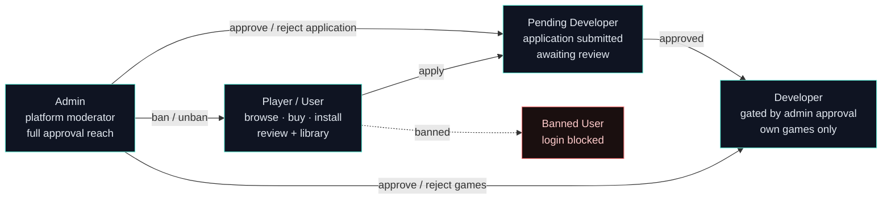
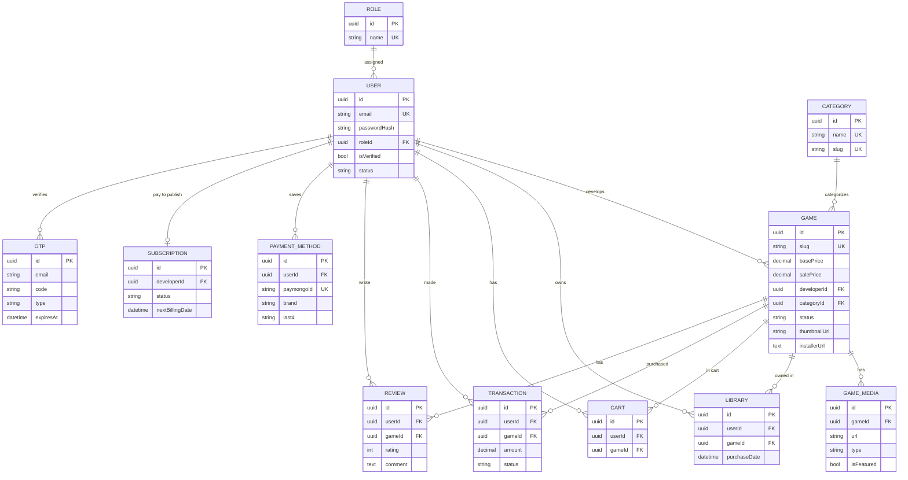
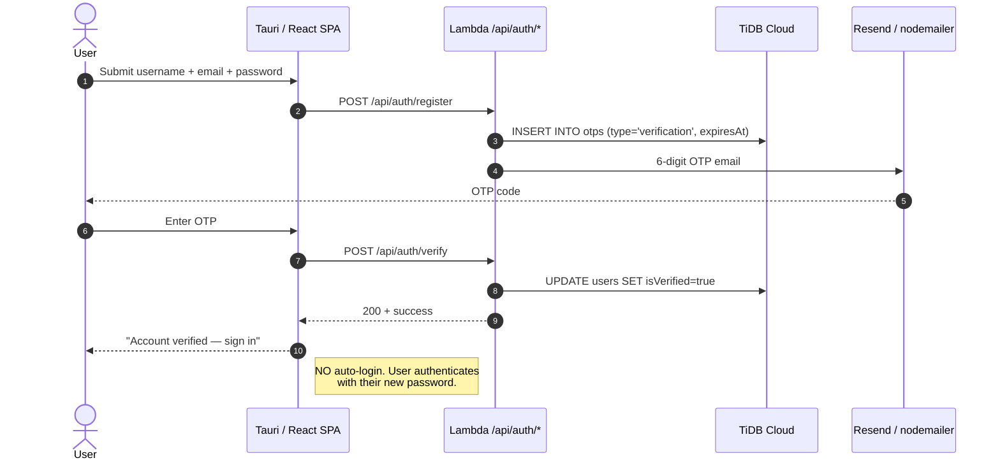
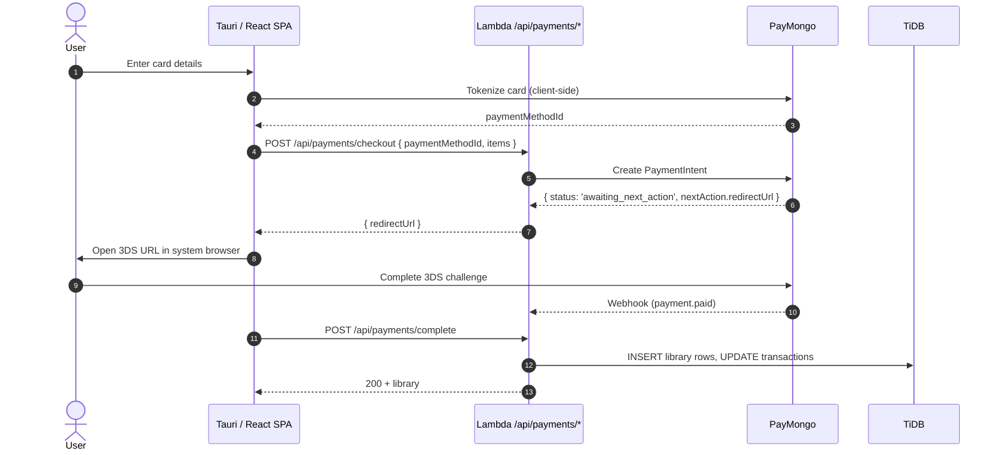
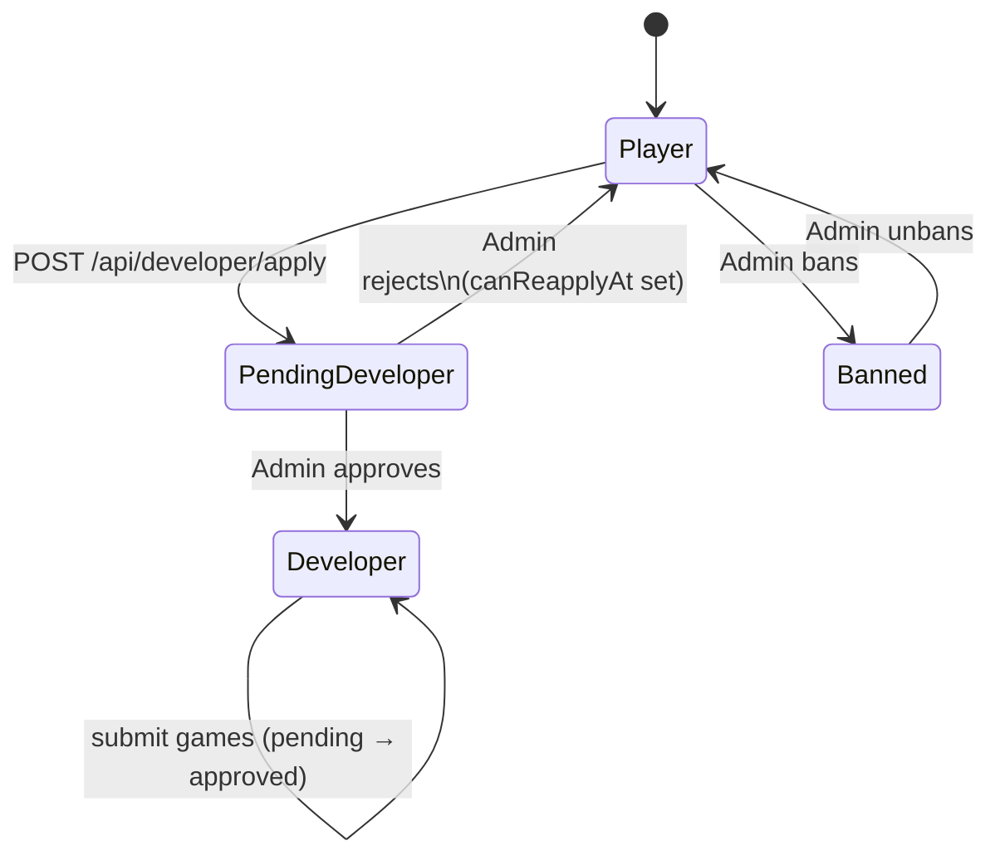

# AscienteHub — Backend

> A Steam-style desktop game launcher and storefront — players sign up, browse a catalog, pay with PayMongo (3-D Secure automatic), and install + launch titles from a real native Windows binary. This repo is the **serverless REST API** that powers it.

AscienteHub is a full-stack game distribution platform. The backend is a TypeScript/Express 5 API deployed as an AWS Lambda Function URL. It handles auth (OTP-verified), game catalog moderation, multi-game checkout with PayMongo, Cloudflare R2 media uploads, Redis caching, and rate limiting — all designed to run on perpetual free tiers.

The SPA desktop client lives in the sister repo: [`Asciente-rks/ascientehub-frontend`](https://github.com/Asciente-rks/ascientehub-frontend) (Tauri 2 + React 18 + Rust shell).

---

## Live Demo

- **Download (Windows installer):** [`ascientehub_0.1.0_x64-setup.exe`](https://github.com/Asciente-rks/ascientehub-frontend/releases/download/v1.0.2/ascientehub_0.1.0_x64-setup.exe) (v1.0.2, ~4 MB)
- **All releases:** [github.com/Asciente-rks/ascientehub-frontend/releases](https://github.com/Asciente-rks/ascientehub-frontend/releases)
- **Backend:** AWS Lambda Function URL (`ap-southeast-1`)

> First time? Windows SmartScreen will warn (unsigned binary) — click **More info → Run anyway**. Installer stores games in `%APPDATA%/com.ascientehub.app/games/<slug>/`.

---

## Table of Contents

1. [What It Does](#what-it-does)
2. [Architecture](#architecture)
3. [Role Hierarchy](#role-hierarchy)
4. [Tech Stack](#tech-stack)
5. [Database Design](#database-design)
6. [Repository Layout](#repository-layout)
7. [API Reference](#api-reference)
8. [Authentication & Onboarding Flows](#authentication--onboarding-flows)
9. [Security](#security)
10. [Deployment & Environment Variables](#deployment--environment-variables)
11. [Cost Breakdown](#cost-breakdown)
12. [Local Development](#local-development)
13. [Repos](#repos)
14. [Author](#author)

---

## What It Does

- **Serve the catalog** — anonymous `GET /api/public/games` is Redis-cached (1h TTL) so the Tauri client gets sub-ms reads on warm cache; authenticated reads bypass cache for fresh data.
- **Three-tier role model** — players, developers (gated by admin approval), admins. `role.middleware.ts` enforces this on every route group.
- **Developer flow** — apply → admin approves → submit games (status `pending` → `approved`) → upload thumbnails / gallery / trailers / `.zip` installers via Multer → Cloudflare R2.
- **Admin moderation** — approve/reject developer applications and game submissions, ban users.
- **Multi-game checkout** — entire cart checked out in one PayMongo charge with **3-D Secure automatic**. Single-game purchase also supported.
- **Save cards** — PayMongo payment-method tokenization; only the `paymongoId` is stored — no PAN ever written to TiDB.
- **OTP-driven auth** — email verification on register, password reset, account-deletion confirmation. Resend as primary, nodemailer as SMTP fallback.
- **Lambda cold-start hardened** — `OPTIONS` preflights short-circuit before DB init; Sequelize connection is cached at module scope; `ensureGameSchema()` adds optional columns idempotently so deployments tolerate stale schemas.
- **Public-GET cache** (Redis, 1h TTL) on `/api/public/*`, `/api/games`, and `/api/games/:id` — only when no auth headers are present.
- **CORS force-injected** on every response including 5xx, so the desktop client never sees a missing-CORS error.

---

## Architecture



### Notable architectural choices

- **`@vendia/serverless-express` adapter** — Express 5 mounts unchanged; the adapter maps Lambda Function URL events to Express `req`/`res`. No API Gateway configuration needed.
- **Lambda cold-start hardening** in `src/lambda.ts`: `OPTIONS` preflights exit before any DB access; the Sequelize pool is module-scoped so subsequent warm invocations reuse it; `ensureGameSchema()` applies `ALTER TABLE ... ADD COLUMN IF NOT EXISTS` idempotently for `installerUrl` and `videoUrl` — deployments never fail on schema drift.
- **Public-GET cache** (Redis, 1h TTL) gated on the absence of `Authorization` headers — authenticated users see fresh data, anonymous storefronts hit cache.
- **CORS force-injected** including 5xx paths so the Tauri desktop client never sees a cross-origin error regardless of server-side failures.
- **Direct R2 uploads capped at 50 MB** — larger installers should be uploaded out-of-band (e.g. `rclone`) and the resulting URL stored in `games.installerUrl`.
- **TiDB over RDS** — RDS free tier expires after 12 months; TiDB Cloud Serverless is perpetual. MySQL-wire-compatible so `mysql2` works without changes.
- **R2 over S3** — zero egress fees, which matters when shipping installer ZIPs to end users.

---

## Role Hierarchy



| Role | Created via | Catalog access | Key permissions |
|------|-------------|----------------|-----------------|
| `Admin` | Seeded (`provision.ts`) | Full cross-platform | Moderate games + developers + users |
| `Developer` | User applies → admin approves | Own games CRUD | Upload media, view own stats |
| `User` (Player) | Self-register + OTP verify | Browse + purchase | Cart, library, reviews, profile |

---

## Tech Stack

| Layer | Technology | Why |
|-------|-----------|-----|
| Runtime | Node.js 18 + TypeScript 6 | Serverless-friendly, mature ecosystem |
| Framework | Express 5 | Familiar, swappable, works fine in Lambda |
| Lambda adapter | `@vendia/serverless-express` ^4 | Maps Function URL events to Express |
| ORM | Sequelize 6 + `mysql2` | Models + associations + auto-sync in one package |
| Database | **TiDB Cloud Serverless** | MySQL-wire-compatible, **5 GB free perpetual**, no cold start |
| Object storage | **Cloudflare R2** via `@aws-sdk/client-s3` | **Zero egress fees**, S3-compatible API |
| Uploads | Multer ^2 + R2 | Multipart in → S3 PUT out |
| Auth | JWT (`jsonwebtoken`) + bcrypt | Stateless, standard |
| Validation | Yup ^1 | Tiny, ergonomic, no plugin churn |
| Email | Resend ^6 + nodemailer fallback | Resend: 100/day free; nodemailer SMTP fallback |
| Cache + rate limit | Redis via `ioredis` + `node-cache` in-memory fallback | Cheap, fast, free tier (Upstash) |
| Payments | **PayMongo** REST (PHP, 3DS auto) | Local PH provider, free signup, no FX conversion |
| Testing | Jest ^30 + Supertest | Standard Node testing |
| CI/CD | GitHub Actions → `aws lambda update-function-code` | Free for private repos under monthly limits |

The frontend SPA (Tauri 2 desktop shell + React 18 + Tailwind 3) lives in [`ascientehub-frontend`](https://github.com/Asciente-rks/ascientehub-frontend). This repo ships only the API.

---

## Database Design

All primary keys are UUID v4. Relationships are wired in `src/models/associations.ts`. Schema is managed by Sequelize `sync()` plus a defensive `ensureGameSchema()` step on cold start that adds optional columns idempotently.



### Key tables

**`users`** — Player, developer, and admin accounts. `roleId` references `roles`.

| Column | Type | Notes |
|--------|------|-------|
| `id` | UUID (PK) | UUIDv4 |
| `username` | VARCHAR | unique |
| `email` | VARCHAR | unique, validated |
| `password` | VARCHAR | bcrypt hash, nullable for OAuth |
| `roleId` | UUID (FK → roles.id) | not null |
| `isVerified` | BOOLEAN | default false |
| `isBanned` | BOOLEAN | default false |
| `status` | ENUM | `'active' \| 'pending' \| 'rejected'` (developer-application gate) |

**`games`** — The catalog. Slug auto-generated from title in a `beforeValidate` Sequelize hook.

| Column | Type | Notes |
|--------|------|-------|
| `id` | UUID (PK) | |
| `slug` | VARCHAR | unique, lowercase + dashed |
| `basePrice` | DECIMAL(10,2) | PHP |
| `salePrice` | DECIMAL(10,2) | optional |
| `developerId` | UUID (FK → users.id) | not null |
| `categoryId` | UUID (FK → categories.id) | not null |
| `status` | ENUM | `'pending' \| 'approved' \| 'rejected'` (admin moderation) |
| `thumbnailUrl` | VARCHAR | R2 URL |
| `installerUrl` | TEXT | R2 URL of `.zip` |
| `videoUrl` | VARCHAR | R2 URL of trailer, optional |

**`payment_methods`** — Tokenized cards. **No PAN ever stored** — only the PayMongo handle and display metadata.

| Column | Type | Notes |
|--------|------|-------|
| `paymongoId` | VARCHAR | unique, the PayMongo payment-method ID |
| `brand` | VARCHAR | `'visa'`, `'mastercard'`, etc. |
| `last4` | VARCHAR | display only |

**`otps`** — 6-character codes for verification, password reset, account deletion. **Keyed by email** (not userId) so verification works *before* the user record exists.

| Column | Type | Notes |
|--------|------|-------|
| `type` | ENUM | `'verification' \| 'password_reset' \| 'account_deletion'` |
| `expiresAt` | DATETIME | enforced on every read |

### Notable design choices

- **`ensureGameSchema()`** on cold start — adds `installerUrl` and `videoUrl` as optional columns if absent. Deployment never fails on a stale schema.
- **Connection pool sized for serverless** — `max: 5`, `min: 0`, `acquire: 30s`, `idle: 10s`. TiDB Cloud Serverless has no cold-start penalty on the DB side, so the pool warms quickly.
- **`libraries` junction** — a row here means "user owns this game". The Tauri shell checks this table before allowing a launch.
- **`transactions`** — financial audit trail; one row per attempted/successful charge. Never deleted.

---

## Repository Layout

```
ascientehub-backend/
├── .github/workflows/deploy-lambda.yml    # CI/CD → AWS Lambda
├── .sequelizerc                            # paths for sequelize-cli
├── jest.config.js
├── tsconfig.json
└── src/
    ├── app.ts                              # Express app + route registration
    ├── lambda.ts                           # AWS Lambda handler (cold-start hardened)
    ├── index.ts                            # Local dev entrypoint
    ├── config/                             # db.config.ts, constants.ts
    ├── controllers/                        # admin, auth, cart, category, developer,
    │                                       # game, meta, payment, review, upload, user
    ├── services/                           # Business logic per domain
    ├── repositories/                       # Sequelize query layer
    ├── routes/                             # Express routers (mounted under /api/*)
    ├── models/                             # 12 Sequelize models + associations.ts
    ├── middlewares/                        # auth, role, validator, upload, rateLimit
    ├── schemas/                            # Yup validation schemas
    ├── seeders/                            # roles, categories, production-user
    ├── scripts/                            # provision, seed, seed-demo-game
    ├── dtos/                               # Data transfer types
    └── utils/                              # caching (Redis), mailer
```

---

## API Reference

The Express app mounts ten route groups plus a health check.

| Prefix | Auth | Surface |
|--------|------|---------|
| `GET /health` | none | Liveness probe |
| `/api/public` | none | Catalog browsing (anonymous, **Redis-cached 1h**) |
| `/api/auth` | none for login/register | Login, register, OTP verify, forgot/reset password |
| `/api/users` | JWT | Profile, password change, deletion flow |
| `/api/games` | JWT | Game CRUD (developer + admin scoped) |
| `/api/cart` | JWT | Add / remove / list cart items |
| `/api/reviews` | JWT | Post and read reviews |
| `/api/developer` | JWT | Apply, manage own games, view stats |
| `/api/admin` | JWT + admin | Moderation surfaces |
| `/api/payments` | JWT (except webhook) | PayMongo flows + saved methods |
| `/api/uploads` | JWT | Multipart uploads → Cloudflare R2 |

### Auth & registration

| Method | Path | Auth | Purpose |
|--------|------|------|---------|
| POST | `/api/auth/register` | none | Register + send 6-digit OTP |
| POST | `/api/auth/verify` | OTP | Verify email → `isVerified: true` |
| POST | `/api/auth/login` | none | Email + password → JWT |
| POST | `/api/auth/forgot-password` | none | Email a password-reset OTP |
| POST | `/api/auth/reset-password` | OTP | Set new password |

### Payment endpoints (selected)

| Method | Path | Auth | Purpose |
|--------|------|------|---------|
| POST | `/api/payments/sources` | JWT | Tokenize card → PayMongo source |
| POST | `/api/payments/checkout` | JWT | Checkout entire cart in one charge |
| POST | `/api/payments` | JWT | Single-game purchase |
| POST | `/api/payments/complete` | JWT | Finalize 3DS-authorized payment |
| GET | `/api/payments/methods` | JWT | List saved cards |
| PUT | `/api/payments/methods/:id/default` | JWT | Set default card |
| DELETE | `/api/payments/methods/:id` | JWT | Remove saved card |
| GET | `/api/payments/:paymentId` | JWT | Poll payment status |
| POST | `/api/payments/webhook` | **PUBLIC** | PayMongo callbacks |

---

## Authentication & Onboarding Flows

### Self-registration



### 3-D Secure payment flow



### Developer application gate



---

## Security

| Layer | Defense |
|-------|---------|
| Password storage | bcrypt (cost factor 10), timing-safe compare |
| JWT | HS256, configurable expiry (`JWT_EXPIRES_IN`, default `7d`) |
| OTP | 6-char code, `expiresAt` enforced on every read; keyed by email so no enumeration via userId |
| Role enforcement | `role.middleware.ts` on every admin and developer route group |
| Upload validation | Multer file-type check; uploads capped at 50 MB per file |
| Rate limiting | `rateLimit.middleware.ts` via Redis; in-memory `node-cache` fallback |
| Payment card data | No PAN stored — only the PayMongo `paymentMethodId` handle |
| CORS | Force-injected on every response, including 5xx |
| Webhook integrity | PayMongo webhook signature verification in `payment.controller.ts` |

---

## Deployment & Environment Variables

The deploy workflow (`.github/workflows/deploy-lambda.yml`) pushes on every `main` commit:

```
push to main
   ↓
checkout → setup-node@18 → npm ci → npm run build (tsc)
   ↓
zip dist/* + node_modules + package.json + lockfile → function.zip
   ↓
aws lambda update-function-code --function-name ascientehub-backend
```

AWS credentials and region are injected from GitHub repo secrets.

### Required secrets (CI)

| Variable | Purpose |
|----------|---------|
| `AWS_ACCESS_KEY_ID` / `AWS_SECRET_ACCESS_KEY` | AWS credentials |
| `AWS_REGION` | Lambda region (e.g. `ap-southeast-1`) |

### Environment variables (Lambda / `.env.development`)

```env
# Database (TiDB Cloud Serverless)
DB_NAME=
DB_USER=
DB_PASSWORD=
DB_HOST=
DB_PORT=4000

# Auth
JWT_SECRET=
JWT_EXPIRES_IN=7d

# Email (Resend)
RESEND_API_KEY=
EMAIL_FROM=

# Cloudflare R2
R2_ACCESS_KEY_ID=
R2_SECRET_ACCESS_KEY=
R2_ENDPOINT=
R2_BUCKET_NAME=
R2_PUBLIC_URL=
LAMBDA_UPLOAD_URL=          # optional, for offloaded large uploads

# Redis
REDIS_URL=

# PayMongo
PAYMONGO_SECRET_KEY=
PAYMONGO_PUBLIC_KEY=
```

### First-time bootstrap

```bash
npm run provision        # Creates DB tables via Sequelize sync()
npm run seed             # Roles, categories, demo user
npm run seed:production  # Production-safe subset (roles + categories)
npm run seed-demo-game   # Populate catalog with flagship + dummy games
```

### Seeded demo accounts

All share the same password. Accounts are pre-verified (`isVerified: true`).

| Username | Email | Role | Password |
|----------|-------|------|----------|
| `Admin1` | `admin1@example.com` | Admin | `Password123` |
| `Developer1` | `developer1@example.com` | Developer | `Password123` |
| `Buyer1` | `buyer1@example.com` | User | `Password123` |

---

## Cost Breakdown

Designed for **$0/month forever** — every service runs on a free tier with no expiry.

| Service | Free tier | We use | Headroom |
|---------|-----------|--------|----------|
| AWS Lambda | 1M invocations/mo + 400K GB-s | ~5K invocations/mo | **99.5%** |
| TiDB Cloud Serverless | 5 GB storage, 250M RU/mo | <100 MB | **98%+** |
| Cloudflare R2 | 10 GB storage, 1M Class A ops, **zero egress** | <1 GB | **90%+** |
| Redis (Upstash) | 10K commands/day | ~1K cmds/day | **90%** |
| Resend | 3K emails/mo, 100/day | ~20/day during testing | **80%+** |
| PayMongo | Free signup, no monthly fee | only transaction % | n/a |
| GitHub Actions (private) | 2000 min/mo (Pro: more) | ~10 min/mo | **99.5%** |

**Monthly total: $0/month**

**Why each free tier was chosen:**

- **AWS Lambda over a long-running server** — pay only for actual invocations; idle launcher users cost zero.
- **TiDB over RDS / Aurora** — RDS free tier expires after 12 months; TiDB Cloud's free tier is **perpetual**, no expiry.
- **R2 over S3** — S3 charges per-GB egress; R2 is zero egress, which matters when shipping installer ZIPs to end users.
- **PayMongo over Stripe** — local PH provider, lower cards-not-present fees, native PHP currency, no FX conversion.

---

## Local Development

```bash
git clone https://github.com/Asciente-rks/ascientehub-backend.git
cd ascientehub-backend
npm install

# Create .env.development with the variables listed above
npm run dev              # nodemon src/index.ts on port 3000 (override with PORT=...)
```

Useful scripts:

```bash
npm run dev                          # local dev server (nodemon)
npm run build                        # tsc → dist/
npm test                             # Jest, single-thread
npm run provision                    # first-time DB bootstrap
npm run seed                         # all seeders (roles, categories, demo user)
npm run seed:production              # production-safe subset
npm run seed-demo-game               # populate the catalog with the flagship + dummy games
npm run seed-demo-game:production    # production variant
```

The Lambda entrypoint (`src/lambda.ts`) and the local entrypoint (`src/index.ts`) both import the same `src/app.ts` — no dual-maintenance.

---

## Repos

| Repository | What it is | Stack |
|------------|-----------|-------|
| [`ascientehub-backend`](https://github.com/Asciente-rks/ascientehub-backend) | Serverless REST API (**this repo**) | Node.js 18 + TypeScript + Express 5 + Sequelize |
| [`ascientehub-frontend`](https://github.com/Asciente-rks/ascientehub-frontend) | Tauri 2 desktop launcher (Windows) | Rust shell + React 18 + TypeScript + Tailwind |

---

## Author

**Ralph Kenneth Sonio** — [Portfolio](https://asciente-portfolio.vercel.app) · [GitHub](https://github.com/Asciente-rks)
