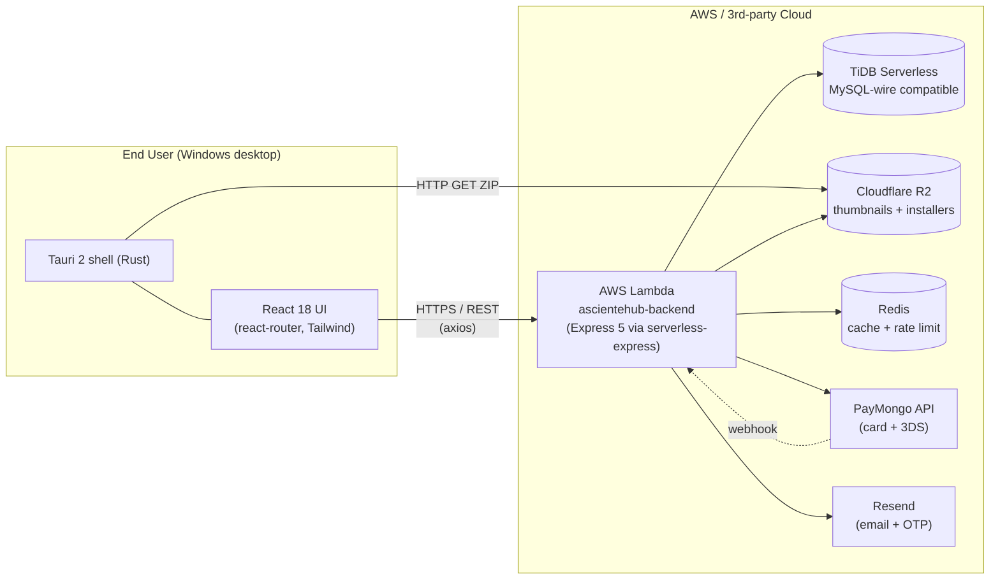
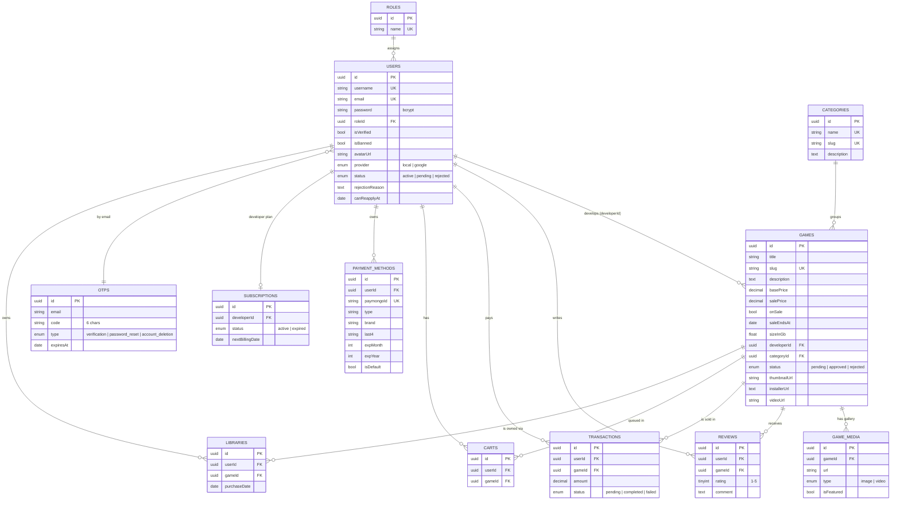
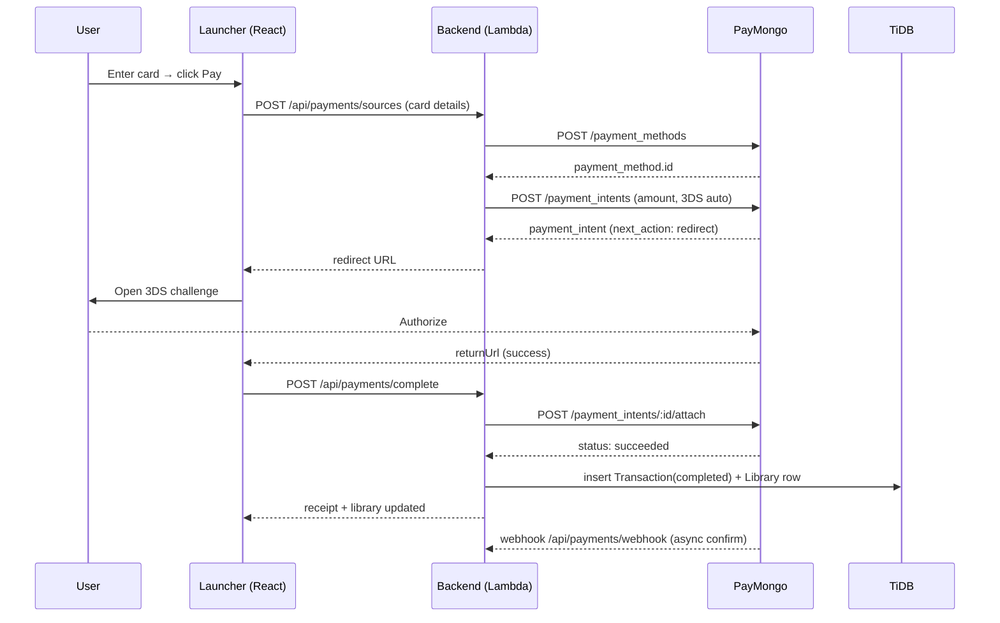

# AscienteHub

> A Steam-style game launcher and storefront — desktop client, REST API, and a real shipped indie game inside.

AscienteHub is a full-stack game distribution platform built around a custom Windows desktop launcher. Players sign up, browse a catalog of games, purchase with credit card via PayMongo, and install + launch titles directly from the launcher. Developers can apply for a publisher role, upload installers, and track sales. Admins moderate developer applications and game submissions.

The system spans **two repositories**, plus the actual indie game shipped through it as the flagship title.

| Repository | What it is | Stack |
|---|---|---|
| [`ascientehub-frontend`](https://github.com/Asciente-rks/ascientehub-frontend) | Tauri desktop launcher (Windows) | Rust shell + React 18 + TypeScript + Tailwind |
| [`ascientehub-backend`](https://github.com/Asciente-rks/ascientehub-backend) | Serverless REST API | Node.js 18 + TypeScript + Express 5 + Sequelize |

> **You're reading the README in one of those repos.** The same overview lives in both — scroll to [Local Development](#local-development) for setup specific to this repo.

---

## Table of Contents

1. [Highlights](#highlights)
2. [System Architecture](#system-architecture)
3. [Tech Stack](#tech-stack)
4. [Repository Layout](#repository-layout)
5. [Database Design](#database-design)
6. [Feature Tour](#feature-tour)
7. [API Reference](#api-reference)
8. [Game Launcher Mechanics](#game-launcher-mechanics)
9. [Payment Flow (PayMongo)](#payment-flow-paymongo)
10. [Deployment Summary](#deployment-summary)
11. [Local Development](#local-development)
12. [Environment Variables](#environment-variables)
13. [Download the Launcher](#download-the-launcher)

---

## Highlights

- **Real desktop app, not a web wrapper.** The launcher is a native Tauri 2 binary (~5 MB portable zip) that downloads game ZIPs, extracts them to per-user app-data, locates the executable, and spawns it as a child process — exactly the Steam pattern.
- **Ships with a real game.** The flagship title in the catalog is an actual indie game from the author's game-development portfolio. Other catalog entries are demo games used to exercise the storefront.
- **Production-grade serverless backend.** Express 5 API packaged for AWS Lambda via `@vendia/serverless-express`, fronted by a Function URL, with TiDB Serverless for the database, Cloudflare R2 for object storage, and Redis for caching + rate-limiting.
- **PayMongo card payments with 3-D Secure.** PHP-denominated charges, payment-method tokenization, saved cards, full webhook handling for asynchronous confirmation.
- **Three-tier role model.** Players, developers (gated by admin approval), and admins — each with their own UI surfaces and protected routes.
- **CI/CD on every push.** GitHub Actions builds the TypeScript Lambda and pushes it to AWS automatically when `main` advances.

---

## System Architecture



**Request lifecycle (cold start):**

1. Client calls `https://<lambda-function-url>/api/...`.
2. `OPTIONS` preflights short-circuit before DB init for snappy CORS.
3. First request initializes Sequelize, sets up associations, runs a non-destructive `ensureGameSchema()` to add any missing columns, and caches the connection in module scope (warm Lambdas reuse it).
4. For safe public `GET`s without auth headers (`/api/public/*`, `/api/games`, `/api/games/:id`), the handler checks Redis first; cache hits return immediately. Cache TTL is 1 hour.
5. Otherwise the request flows through Express middleware (CORS, JSON, rate limit, auth) into the route handler.
6. CORS headers are force-injected on every response, including 5xx, so the desktop client never sees a missing-CORS error.

---

## Tech Stack

### Frontend (`ascientehub-frontend`)

| Layer | Choice |
|---|---|
| Desktop shell | **Tauri 2** (Rust 2021 edition) |
| UI framework | **React 18** + TypeScript 4.9 |
| Build tool | `react-scripts` (CRA) |
| Routing | `react-router-dom` 6 |
| Styling | **Tailwind CSS 3** + PostCSS |
| HTTP | `axios` |
| Tauri Rust deps | `reqwest` (rustls-tls), `zip`, `tokio`, `walkdir`, `webbrowser` |
| Distribution | Portable Windows ZIP (~5 MB) |

### Backend (`ascientehub-backend`)

| Layer | Choice |
|---|---|
| Runtime | **Node.js 18** (TypeScript 6) |
| Framework | **Express 5** |
| ORM | **Sequelize 6** (`mysql2` driver) |
| Database | **TiDB Serverless** (MySQL-wire-compatible, SSL) |
| Auth | **JWT** (`jsonwebtoken`) + **bcrypt** password hashing |
| Validation | **Yup** |
| Object storage | **Cloudflare R2** via `@aws-sdk/client-s3` (S3-compatible) |
| Email | **Resend** + `nodemailer` fallback |
| Cache + rate limit | **Redis** via `ioredis`, `node-cache` fallback |
| Payments | **PayMongo** REST API (PHP, 3DS automatic) |
| Uploads | `multer` (multipart/form-data) |
| Lambda adapter | `@vendia/serverless-express` |
| Test | Jest + Supertest |
| Migrations | `sequelize-cli` |

---

## Repository Layout

### Backend tree (high level)

```
ascientehub-backend/
├── .github/workflows/deploy-lambda.yml   # CI/CD → AWS Lambda
├── .sequelizerc                           # paths for sequelize-cli
├── jest.config.js
├── tsconfig.json
└── src/
    ├── app.ts            # Express app + route registration
    ├── lambda.ts         # AWS Lambda handler (cold-start hardened)
    ├── index.ts          # Local dev entrypoint
    ├── config/           # db.config.ts, constants.ts
    ├── controllers/      # admin, auth, cart, category, developer,
    │                     # game, meta, payment, review, upload, user
    ├── services/         # Business logic for each domain
    ├── repositories/     # Sequelize query layer
    ├── routes/           # Express routers (mounted under /api/*)
    ├── models/           # 12 Sequelize models + associations.ts
    ├── middlewares/      # auth, role, validator, upload, rateLimit
    ├── schemas/          # Yup validation schemas
    ├── seeders/          # Roles, categories, production user
    ├── scripts/          # provision, seed, seed-demo-game
    ├── dtos/             # Data transfer types
    └── utils/            # caching (Redis), mailer
```

### Frontend tree (high level)

```
ascientehub-frontend/
├── AscienteHub-v1.0.0-windows-portable.zip   # Shipped binary
├── postcss.config.js / tailwind.config.js
├── public/index.html
├── src-tauri/                                # Rust desktop shell
│   ├── Cargo.toml
│   ├── tauri.conf.json                       # 1280×720 window
│   └── src/main.rs                           # download_and_extract_game,
│                                             # launch_game, open_external_url
└── src/
    ├── App.tsx                                # Route table
    ├── api/apiClient.ts                       # Axios instance + interceptors
    ├── components/                            # GameCard, Sidebar, Topbar,
    │                                          # RequireAuth, RequireRole, ...
    ├── context/                               # Auth, Theme, Registration
    ├── pages/
    │   ├── auth/                              # SignIn, Register, Verify,
    │   │                                      # Forgot, ResetPassword
    │   ├── Home.tsx, Games.tsx, GameDetail.tsx
    │   ├── Cart.tsx, Library.tsx, PurchaseHistory.tsx
    │   ├── Profile.tsx, ChangePassword.tsx,
    │   │   ApplyDeveloper.tsx,
    │   │   RequestDeletion.tsx, ConfirmDeletion.tsx
    │   ├── ManageGames.tsx, ManageGameDetail.tsx        # developer
    │   └── AdminPendingDevelopers.tsx,
    │       AdminPendingGames.tsx, AdminUsers.tsx        # admin
    ├── services/                              # One axios wrapper per domain
    ├── styles/tailwind.css
    └── utils/                                 # tauriRuntime, jwtHelpers,
                                               # roleHelpers, formatters,
                                               # uploadProxy
```

---

## Database Design

All primary keys are UUID v4. Relationships are wired in `src/models/associations.ts`. Schema is managed by Sequelize `sync()` plus a defensive `ensureGameSchema()` step on cold start that adds optional columns (`installerUrl`, `videoUrl`) idempotently.



### Notes on the schema

- **Library is a true junction table** (`User ↔ Game`, with a `purchaseDate` overriding `createdAt`). A user "owning" a game means a row exists here.
- **Game.slug auto-generates** from `title` in a `beforeValidate` hook (lowercase, dashes, alphanumerics) so storefront URLs are SEO-friendly.
- **Otp is keyed to `email`, not `userId`** — this is intentional so verification OTPs work *before* the user record exists.
- **PaymentMethod.paymongoId** is the unique handle PayMongo gives each tokenized card; the rest of the row is display metadata only (no PAN ever stored).
- **Subscription is per-developer**, not per-user — it represents the "pay to publish" plan for developer accounts.

---

## Feature Tour

### Player

- Email/password signup with **OTP email verification** (Resend)
- Forgot/reset password (OTP-driven)
- Browse public catalog (`/games`) — featured + full list, both Redis-cached
- Game detail page with gallery, video trailer, reviews, ratings
- **Cart** with multi-game checkout
- **Library** — list of owned games with one-click install/launch
- **Purchase history** with transaction status
- **Saved cards** (PayMongo payment methods) — list, set default, delete
- Profile editing, avatar upload (R2), password change
- **Soft account deletion** with OTP-guarded confirmation

### Developer

- Apply via `/profile/apply-developer` — populates `users.status = 'pending'`
- After admin approval, gain access to `/manage-games`:
  - Submit new games (status starts `pending`)
  - Upload thumbnails, gallery (screenshots), trailer, and `.zip` installers via R2
  - Edit pricing, sales, descriptions
  - View earnings on approved titles
- Per-developer subscription enforced (`subscriptions` table)

### Admin

- `/admin/pending-developers` — approve/reject applicants with reason and re-apply cooldown
- `/admin/pending-games` — moderate game submissions
- `/admin/users` — full user roster, ban/unban controls

---

## API Reference

The Express app mounts ten route groups plus a health check.

| Prefix | Auth | Purpose |
|---|---|---|
| `/health` | none | Liveness probe (returns `{ status: "UP", ... }`) |
| `/api/public` | none | Catalog browsing (anonymous, cached) |
| `/api/auth` | none for login/register | Login, register, OTP verify, forgot/reset password |
| `/api/users` | JWT | Profile, password change, deletion flow |
| `/api/games` | JWT | Game CRUD (developer + admin scoped) |
| `/api/cart` | JWT | Add / remove / list cart items |
| `/api/reviews` | JWT | Post and read reviews |
| `/api/developer` | JWT | Apply, manage own games, view stats |
| `/api/admin` | JWT + admin | Moderation surfaces |
| `/api/payments` | JWT (except webhook) | PayMongo flows + saved methods |
| `/api/uploads` | JWT | Multipart uploads → Cloudflare R2 |

### Selected payment endpoints

```
POST   /api/payments/sources              create PayMongo source / tokenize card
POST   /api/payments/checkout             checkout entire cart in one charge
POST   /api/payments                      single-game purchase
POST   /api/payments/complete             finalize 3DS-authorized payment
GET    /api/payments/methods              list saved cards
PUT    /api/payments/methods/:id/default  set default card
DELETE /api/payments/methods/:id          remove saved card
GET    /api/payments/:paymentId           poll payment status
POST   /api/payments/webhook              PUBLIC — PayMongo callbacks
```

---

## Game Launcher Mechanics

The Tauri shell exposes three Rust commands to the React UI via `@tauri-apps/api`:

```rust
#[tauri::command]
async fn download_and_extract_game(app, url, slug) -> Result<String, String>

#[tauri::command]
fn launch_game(exe_path) -> Result<(), String>

#[tauri::command]
fn open_external_url(url) -> Result<(), String>
```

**Install flow:**

1. User clicks **Install** on a library entry → React calls `download_and_extract_game(installerUrl, gameSlug)`.
2. Rust resolves the per-user app-data dir (e.g. `%APPDATA%/com.ascientehub.app/games/<slug>/`) and creates it.
3. If a `.exe` is already extracted there, the path is returned immediately — installs are idempotent.
4. Otherwise, `reqwest` streams the ZIP, validates the `PK` signature, writes `game.zip`, and `zip::ZipArchive` extracts in place.
5. `walkdir` finds the first `.exe` in the tree and returns its absolute path.

**Launch flow:**

1. User clicks **Play** → React calls `launch_game(exe_path)`.
2. Rust spawns the executable as a detached child process with `cwd` set to the executable's directory (so the game finds its assets).

**External links** (developer storefronts, support pages, etc.) go through `open_external_url`, which uses the `webbrowser` crate to hand off to the OS default browser.

---

## Payment Flow (PayMongo)

Card payments are denominated in **PHP** and converted to centavos (×100) before being sent to PayMongo. 3-D Secure is requested automatically.



**Why both `/complete` and `/webhook`?** The synchronous `/complete` flow gives the user instant feedback when they return from the 3DS challenge; the webhook is the source of truth that reconciles any client-side dropout (closed window, network blip) so the library update is never lost.

---

## Deployment Summary

### Backend → AWS Lambda

| Item | Value |
|---|---|
| Runtime | Node.js 18 |
| Function name | `ascientehub-backend` |
| Adapter | `@vendia/serverless-express` |
| Trigger | AWS Lambda Function URL (HTTP) |
| Cold-start opt | DB connection cached at module scope, OPTIONS short-circuited, schema self-heal idempotent |

**CI/CD** (`.github/workflows/deploy-lambda.yml`) runs on every push to `main`:

```
checkout → setup-node@18 → npm ci → npm run build (tsc)
        → zip dist/* + node_modules + package.json + lockfile
        → aws lambda update-function-code --function-name ascientehub-backend
```

AWS credentials and region are injected from GitHub repo secrets (`AWS_ACCESS_KEY_ID`, `AWS_SECRET_ACCESS_KEY`, `AWS_REGION`).

### Database → TiDB Serverless

MySQL-wire-compatible, accessed via `mysql2` over **TLS**. Pool sized for serverless: `max: 5`, `min: 0`, `acquire: 30 s`, `idle: 10 s`. The free tier handles small bursts well; for production, raise the pool max only if Lambda concurrency exceeds it.

### Storage → Cloudflare R2

Standard S3 SDK with `region: "auto"`, `forcePathStyle: true`. Direct uploads from Lambda are capped at **50 MB** per file; larger installers should be uploaded to R2 out-of-band and the resulting URL stored in `games.installerUrl`.

### Frontend → Portable Windows ZIP

The `src-tauri/` shell builds a self-contained Windows binary. The repo ships a pre-built `AscienteHub-v1.0.0-windows-portable.zip` (~5 MB) — unzip and run `AscienteHub.exe`. No installer required.

To rebuild the launcher: `npm run build` produces the React bundle in `build/`, then `cargo tauri build` (or `tauri build` via `@tauri-apps/cli`) packages the desktop binary against `tauri.conf.json`.

---

## Local Development

### Backend

```bash
git clone https://github.com/Asciente-rks/ascientehub-backend.git
cd ascientehub-backend
npm install

# Create .env.development with the variables below
npm run dev          # nodemon src/index.ts on port 3001
```

Useful scripts (from `package.json`):

```bash
npm run dev                       # local dev server (nodemon)
npm run build                     # tsc → dist/
npm test                          # Jest, single-thread
npm run provision                 # first-time DB bootstrap
npm run seed                      # all seeders (roles, categories, demo user)
npm run seed:production           # production-safe subset
npm run seed-demo-game            # populate the catalog with the flagship + dummy games
npm run seed-demo-game:production # production variant
```

### Frontend

```bash
git clone https://github.com/Asciente-rks/ascientehub-frontend.git
cd ascientehub-frontend
npm install

# Web-only dev (browser, points at backend)
npm start             # CRA dev server on port 3001

# Full desktop dev (requires Rust toolchain + Tauri prereqs)
npx tauri dev         # spawns the Tauri shell against the dev server
```

`tauri.conf.json` is configured to load the React dev server from `http://localhost:3001`. For production desktop builds: `npm run build && npx tauri build`.

---

## Environment Variables

### Backend (`.env.development` / `.env.production`)

```env
# --- Database (TiDB Serverless) ---
DB_NAME=
DB_USER=
DB_PASSWORD=
DB_HOST=
DB_PORT=4000

# --- Auth ---
JWT_SECRET=
JWT_EXPIRES_IN=7d

# --- Email (Resend) ---
RESEND_API_KEY=
EMAIL_FROM=

# --- Cloudflare R2 ---
R2_ACCESS_KEY_ID=
R2_SECRET_ACCESS_KEY=
R2_ENDPOINT=
R2_BUCKET_NAME=
R2_PUBLIC_URL=
LAMBDA_UPLOAD_URL=        # optional, for offloaded large uploads

# --- Redis (cache + rate limit) ---
REDIS_URL=

# --- PayMongo ---
PAYMONGO_SECRET_KEY=
PAYMONGO_PUBLIC_KEY=
```

### Frontend (`.env.development` / `.env.production`)

```env
REACT_APP_API_URL=http://localhost:3001    # or your Lambda Function URL
```

In CI, inject `REACT_APP_API_URL` via GitHub secrets rather than committing `.env.production`.

---

## Download the Launcher

A pre-built Windows portable build is committed to the frontend repo:

**[AscienteHub-v1.0.0-windows-portable.zip](https://github.com/Asciente-rks/ascientehub-frontend/blob/main/AscienteHub-v1.0.0-windows-portable.zip)** (~5 MB)

Unzip anywhere, run `AscienteHub.exe`. The launcher stores installed games in `%APPDATA%/com.ascientehub.app/games/<slug>/`.

---

## Author

Built by [Asciente-rks](https://github.com/Asciente-rks) — full-stack engineering and game development.
The flagship title in the catalog is the author's own indie game; remaining catalog entries are demo titles used to exercise the storefront and payment flow.

---

*This README documents the system end-to-end. For repo-specific deep dives (Sequelize models, individual Tauri commands, controller contracts), browse the source — the code is small enough to read top to bottom.*
